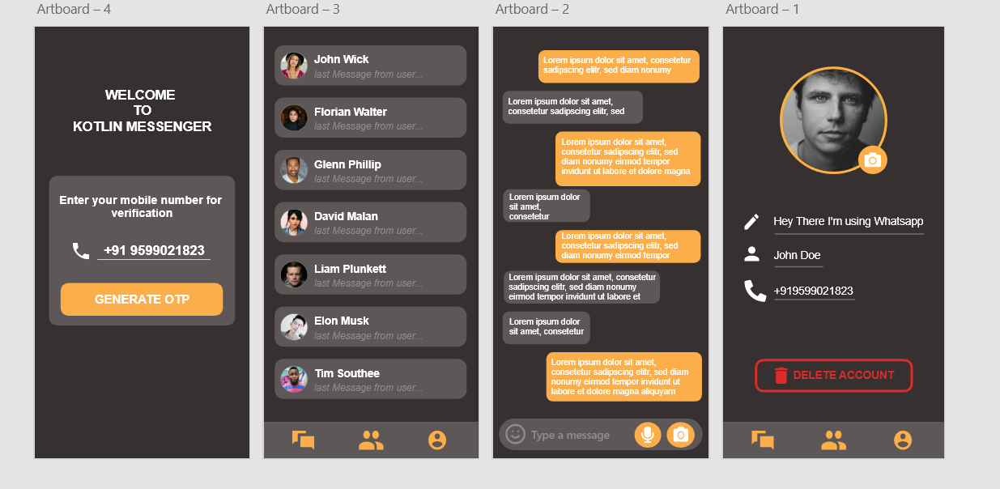

:warning:    **This project is in progress, will be adding new features...**

# Description 

- Application Name - **Kotlin Messenger**
- Architecture Used - MVVM
- Language Used - Kotlin (v1.3.72)  
- IDE used - Android Studio (v4.1.2)  
- Database Used - Firebase Realtime Database 

    

# Components

- Material Design
- Firebase Database
- Firebase Phone Authetication
- Firebase Storage
- Firebase Push Notification

# AdobeXD Design

 
 
 :point_up_2: **Above UI/UX is designed by me using AdobexD, this design and theme will be followed in implementation of the project, however minor changes can be expected in the final product** :sweat_smile: 
